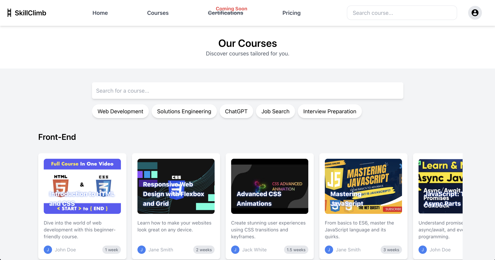

# SkillClimb

## Disclaimer
**The source code for SkillClimb is not included in this repository due to its upcoming commercial release. For code review requests from potential employers, recruiters, or collaboration inquiries, please [email me](mailto:dionisggr@gmail.com?subject=Request%20for%20SkillClimb%20Code%20Walkthrough).**

## What Is It?
SkillClimb is an innovative AI-powered online platform designed for both learners and content creators in the realm of online education. This application offers a personalized learning experience, tailoring course recommendations and supplemental information to each user’s unique profile, knowledge base, resume, and previously taken courses.

Leveraging AI, SkillClimb ensures that learners receive highly relevant material, avoiding the need for mindless browsing. Additionally, for content creators, SkillClimb offers AI-driven tools to generate transcripts, outlines, supplemental material, mini-practices, and quizzes, enhancing the overall quality and engagement of their courses.

## Why Build It?
The motivation behind SkillClimb stems from the need to streamline the online learning process and enhance the quality of educational content. In a world where information is abundant yet scattered, SkillClimb seeks to provide a cohesive and tailored learning journey for each individual. This platform also empowers content creators by automating time-consuming tasks, allowing them to focus more on delivering quality education.

## Table of Contents
1. [Features](#features)
2. [Technologies Used](#technologies-used)
3. [Getting Started](#getting-started)
4. [Usage](#usage)
5. [Screenshots](#screenshots)
6. [Challenges and Learnings](#challenges-and-learnings)
7. [Future Enhancements](#future-enhancements)
8. [Contact](#contact)

## Features
- Personalized course recommendations using AI algorithms
- Dynamic generation of supplemental information tailored to each user's needs
- AI tools for content creators to generate various educational materials
- Intuitive and responsive user interface for an effortless learning experience
- Integration of user profiles for tracking learning progress and preferences

## Technologies Used
SkillClimb is built with a modern tech stack including: **Vue.js** and **TailwindCSS**.

Additional tools and libraries: **@ffmpeg/core**, **@mdi/font** for material design icons, **github-markdown-css**, **marked** for markdown rendering, **vue-material-design-icons**, and **sass** for style management.

## Getting Started
To run SkillClimb locally:

```bash
# Clone the repository
git clone https://github.com/dionisggr/skillclimb.git
cd skillclimb

# Install dependencies
npm install

# Start the local server
npm start
```

## Usage
### Course Discovery
Navigate to SkillClimb to explore a wide range of courses. Utilize the AI-powered search bar to find courses that align with your learning goals and background. 

### Personalized Learning
Experience personalized learning with AI-generated supplemental information and examples, helping you grasp concepts better and more efficiently.

### Content Creation
For educators, use the AI tools to effortlessly create high-quality educational content, including transcripts, outlines, and practice exercises.

## Screenshots





## Challenges and Learnings
The primary challenge in developing SkillClimb was designing and implementing efficient data structures and algorithms for matching skills and categories. Another significant task was devising a cost-effective strategy for personalized AI generations, balancing the need for customization with resource constraints.

One unique and ongoing exploration in SkillClimb is allowing AI to suggest and create specific mini-practice exercises and quizzes by itself. This is a complex area as it involves the AI understanding nuanced educational content and generating relevant, effective learning materials. This aspect of the project remains a work in progress.

## Future Enhancements
- Integration with more educational content providers.
- Expansion of AI capabilities for even more personalized learning experiences.
- Development of mobile applications for iOS and Android.
- Adding social features for collaborative learning.
- Enhanced analytics for content creators to track engagement and effectiveness.

## Contact
For more information or potential collaborations:

- [Portfolio](https://www.dioveloper.com/)
- [LinkedIn](https://www.linkedin.com/in/dionis-gonzalez/)
- [Email](dionisggr@gmail.com)
```